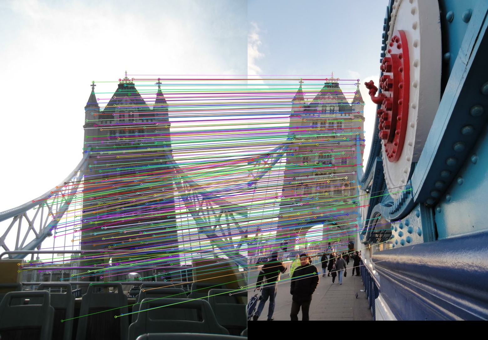
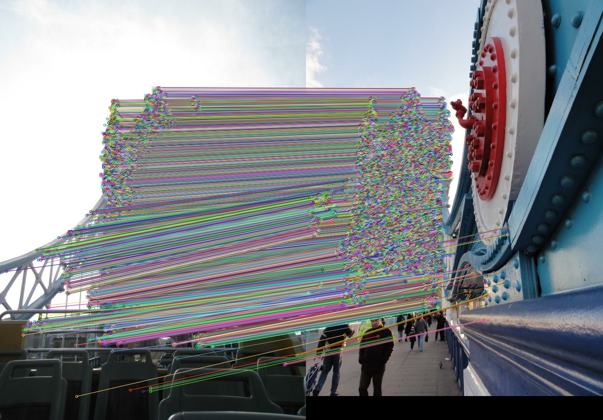

# CasMTR
Official codes of Improving Transformer-based Image Matching by Cascaded Capturing Spatially Informative Keypoints (ICCV2023)

[arxiv paper](https://arxiv.org/abs/2303.02885),
[Project Page](https://ewrfcas.github.io/CasMTR)

- [x] Releasing codes and models.
- [x] Codes about the single pair inference.

## Installation

pytorch==1.10.1\
timm==0.3.2\
pytorch_lightning==1.3.5

```
git clone https://github.com/ewrfcas/CasMTR.git
cd CasMTR
pip install -r requirements.txt
cd cuda_imp/QuadTreeAttention&&python setup.py install
cd cuda_imp/score_cuda&&python setup.py install
```

**Tips:** We find that using pytorch>1.10 (such as 1.13.1) might cause some unexpected errors in CasMTR-2c.

## Datasets

Following [LoFTR](https://github.com/zju3dv/LoFTR/blob/master/docs/TRAINING.md) for more details about the dataset downloading and index settings.

As D2-Net no longer supplies undistorted images, we have uploaded the processed images to this [Link](https://huggingface.co/ewrfcas/CasMTR/resolve/main/Undistorted_SfM.tar) for easy access.

## Inference

### Testing with Metrics

Pretrained model weights ([Download Link](https://1drv.ms/f/s!AqmYPmoRZryegUHqGU4j5731ZUif?e=vgfdgW)).

Inference commands:

```
# test for MegaDepth
bash scripts/test_megadepth-4c.sh
bash scripts/test_megadepth-2c.sh

# test for ScanNet
bash scripts/test_scannet.sh
```

### Single Pair Inference

```
python test_single_pair.py --weight_path pretrained_weights/CasMTR-outdoor-4c/pl_checkpoint.ckpt \
                           --config_path configs/model_configs/outdoor/loftr_ds_quadtree_cas_twins_large_stage3.py \
                           --query_path assets/demo_imgs/london_bridge_19481797_2295892421.jpg \
                           --ref_path assets/demo_imgs/london_bridge_49190386_5209386933.jpg \
                           --confidence_thresh 0.5 \
                           --NMS
```

<div style="display:inline-block" align=center>
  
  
</div>
<br>
<div style="color:orange; border-bottom: 1px solid #d9d9d9;
display: inline-block;
color: #999;
padding: 2px;" align=center>Left: with NMS; Right: without NMS.</div>

## Train

### Outdoor

We have to firstly train the coarse stage for 8 epochs, then refine the 1/4 or 1/2 stages until the convergence.

```
# CasMTR-4c
bash scripts/train_megadepth-4c-stage1.sh
bash scripts/train_megadepth-4c-stage2.sh

# CasMTR-2c
bash scripts/train_megadepth-2c-stage1.sh
bash scripts/train_megadepth-2c-stage2.sh
```

### Indoor

We could directly finetune the frozen QuadTreeMatching weights ([indoor.ckpt](https://drive.google.com/file/d/1pSK_8GP1WkqKL5m7J4aHvhFixdLP6Yfa/view)) with PMT.

Please set the ```quadtree_path``` (the path of indoor.ckpt) correctly.

```
bash scripts/train_scannet-4c.sh
```

## Cite

If you found our project helpful, please consider citing:

```
@inproceedings{cao2023improving,
      title={Improving Transformer-based Image Matching by Cascaded Capturing Spatially Informative Keypoints},
      author={Cao, Chenjie and Fu, Yanwei},
      booktitle={Proceedings of the IEEE/CVF international conference on computer vision},
      year={2023}
}
```

Our codes are partially based on [LoFTR](https://github.com/zju3dv/LoFTR) and [QuadTreeAttention](https://github.com/Tangshitao/QuadTreeAttention).

